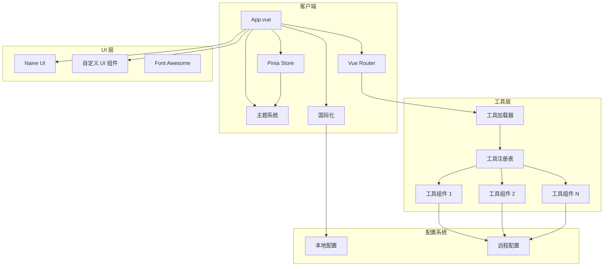
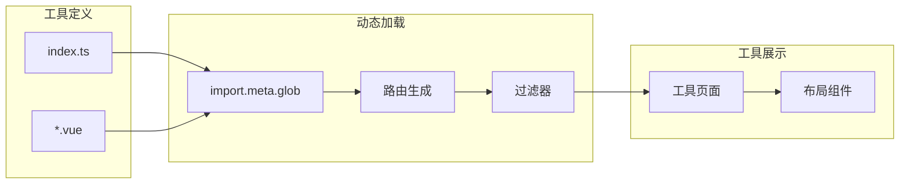
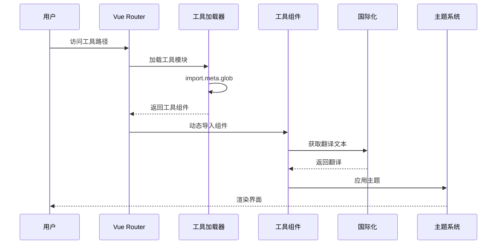

# IT-Tools 系统架构文档

## 概述

IT-Tools 是一个面向开发者的在线工具集合平台，提供超过 400 种实用的开发工具，帮助开发者提高工作效率。该项目采用 Vue 3 + TypeScript 构建，提供了优秀的用户体验（UX）和现代化的界面设计。

## 技术栈

### 前端框架

- **Vue 3** (v3.x) - 渐进式 JavaScript 框架
- **TypeScript** - 类型安全的 JavaScript 超集
- **Vite** - 下一代前端构建工具
- **Pinia** - Vue 3 的状态管理解决方案

### UI 组件库

- **Naive UI** - Vue 3 组件库，提供高质量的 UI 组件
- **@vueuse/core** - Vue Composition API 工具库
- **@vueuse/head** - 管理文档头的 Composition API 工具
- **vue-loading-overlay** - 加载动画组件
- **@fortawesome/fontawesome-svg-core** - 图标库
- **UnoCSS** - 原子化 CSS 引擎

### 路由与国际化

- **Vue Router** (v4.x) - Vue.js 官方路由
- **vue-i18n** - 国际化插件
- **@intlify/unplugin-vue-i18n** - Vue i18n Vite 插件

### 数据处理

- **markdown-it** - Markdown 解析器
- **flexsearch** - 高性能全文搜索库
- **fuse.js** - 轻量级模糊搜索库

### 开发工具

- **Vitest** - Vite 原生测试框架
- **Playwright** - 端到端测试框架
- **ESLint** - 代码检查工具
- **Prettier** - 代码格式化工具

### 其他依赖

- **date-fns** - 日期处理库
- **@faker-js/faker** - 假数据生成器
- **@dice-roller/rpg-dice-roller** - RPG 骰子 roller
- **abort-signal-polyfill** - AbortSignal polyfill
- **vue-shadow-dom** - Shadow DOM 支持

## 项目结构

```
it-tools/
├── src/                        # 源代码目录
│   ├── App.vue                 # 根组件
│   ├── main.ts                 # 应用入口
│   ├── config.ts               # 应用配置
│   ├── router.ts               # 路由配置
│   ├── themes.ts               # 主题配置
│   │
│   ├── assets/                 # 静态资源
│   ├── components/             # 公共组件
│   ├── composable/             # 组合式函数
│   ├── layouts/                # 布局组件
│   ├── pages/                  # 页面组件
│   ├── plugins/                # Vue 插件
│   ├── stores/                 # Pinia 状态存储
│   ├── tools/                  # 工具模块 (435个工具)
│   │   ├── tool.ts             # 工具定义函数
│   │   ├── tools.types.ts      # 工具类型定义
│   │   ├── index.ts            # 工具索引和加载
│   │   ├── [tool-name]/        # 单个工具目录
│   │   │   ├── index.ts        # 工具定义
│   │   │   └── *.vue           # 工具组件
│   │   └── pomodoro-timer/     # 番茄钟应用
│   ├── ui/                     # 自定义 UI 组件库
│   │   ├── c-alert/            # 警告组件
│   │   ├── c-button/           # 按钮组件
│   │   ├── c-card/             # 卡片组件
│   │   ├── c-modal/            # 模态框组件
│   │   ├── c-input-text/       # 文本输入组件
│   │   ├── c-select/           # 选择器组件
│   │   ├── c-diff-editor/      # Diff 编辑器
│   │   ├── c-monaco-editor/    # Monaco 编辑器
│   │   └── theme/              # 主题组件
│   └── utils/                  # 工具函数
│       ├── json5-bigint/       # JSON5 BigInt 支持
│       └── json5-bignum/       # JSON5 BigNum 支持
│
├── public/                     # 公共静态资源
│   └── tools-settings.json     # 工具配置
│
├── locales/                    # 国际化文件
│   ├── en.yml                  # 英语
│   ├── fr.yml                  # 法语
│   └── *.yml                   # 其他语言
│
├── scripts/                     # 构建脚本
│   ├── create-tool.mjs         # 创建工具脚本
│   ├── create-ui.mjs           # 创建 UI 组件脚本
│   └── release.mjs             # 发布脚本
│
├── package.json                # 项目配置
├── vite.config.ts             # Vite 配置
├── tsconfig.json              # TypeScript 配置
└── unocss.config.ts           # UnoCSS 配置
```

## 入口点

### 主入口 - `src/main.ts`

- 初始化 Vue 应用
- 注册插件（Pinia, Vue Router, i18n, Naive UI 等）
- 加载远程配置（tools-settings.json）
- 挂载应用到 #app

### 路由入口 - `src/router.ts`

- 动态加载所有工具路由
- 支持工具重定向
- 加载状态管理

### 工具加载 - `src/tools/index.ts`

- 使用 Vite 的 `import.meta.glob` 动态导入所有工具
- 支持远程工具配置（external-tools.json）
- 支持工具过滤配置（tools-filter.json）

## 子系统

### 1. 工具系统 (Tools Subsystem)

**目的**: 提供可扩展的工具集合框架
**位置**: `src/tools/`
**关键文件**:

- `tools/index.ts` - 工具加载和路由生成
- `tools/tool.ts` - defineTool 工具定义函数
- `tools/tools.types.ts` - 工具类型定义
  **依赖**: Vue Router, 国际化插件
  **被依赖**: 路由系统, 主应用

### 2. UI 组件库 (UI Components)

**目的**: 提供统一的 UI 组件库
**位置**: `src/ui/`
**关键组件**:

- `c-button` - 按钮
- `c-card` - 卡片
- `c-modal` - 模态框
- `c-input-text` - 文本输入
- `c-select` - 选择器
- `c-diff-editor` - Diff 编辑器
- `c-monaco-editor` - Monaco 代码编辑器
  **依赖**: Naive UI, @vueuse/core
  **被依赖**: 工具组件, 页面组件

### 3. 路由系统 (Routing)

**目的**: 管理应用导航和工具路由
**位置**: `src/router.ts`
**关键文件**: 路由定义, 路由守卫
**依赖**: Vue Router, 工具系统
**被依赖**: 主应用

### 4. 状态管理 (State Management)

**目的**: 管理全局应用状态
**位置**: `src/stores/`
**关键文件**: `style.store.ts` - 主题样式状态
**依赖**: Pinia
**被依赖**: UI 组件, 工具组件

### 5. 国际化 (i18n)

**目的**: 提供多语言支持
**位置**: `src/plugins/i18n.plugin.ts`, `locales/`
**依赖**: vue-i18n
**被依赖**: 工具系统, 页面组件

### 6. 主题系统 (Theming)

**目的**: 提供明暗主题切换
**位置**: `src/themes.ts`, `src/ui/theme/`
**依赖**: Naive UI 主题系统
**被依赖**: 主应用, UI 组件

## 系统架构图



## 工具架构



## 数据流



## 工具类型定义

```typescript
interface Tool {
  name: string; // 工具名称
  path: string; // 路由路径
  description: string; // 工具描述
  keywords: string[]; // 搜索关键词
  component: () => Promise<Component>; // 组件加载函数
  icon: Component; // 工具图标
  redirectFrom?: string[]; // 重定向路径
  isNew: boolean; // 是否为新工具
  createdAt?: Date; // 创建时间
  npmPackages?: string[]; // 依赖的 npm 包
  category: string; // 工具分类
}
```

## 关键配置文件

| 文件               | 用途                                    |
| ------------------ | --------------------------------------- |
| `vite.config.ts`   | Vite 构建配置，包含 PWA、UnoCSS、代理等 |
| `tsconfig.json`    | TypeScript 编译配置                     |
| `unocss.config.ts` | UnoCSS 原子化 CSS 配置                  |
| `package.json`     | 项目依赖和脚本                          |
| `.eslintrc.cjs`    | ESLint 代码检查配置                     |
| `.prettierrc`      | Prettier 格式化配置                     |

## 构建与部署

### 开发环境

```bash
pnpm install
pnpm dev
```

### 生产构建

```bash
pnpm build
```

### 测试

```bash
pnpm test        # 运行单元测试
pnpm test:e2e   # 运行端到端测试
```

### 代码质量

```bash
pnpm lint        # 代码检查
pnpm typecheck  # 类型检查
```
