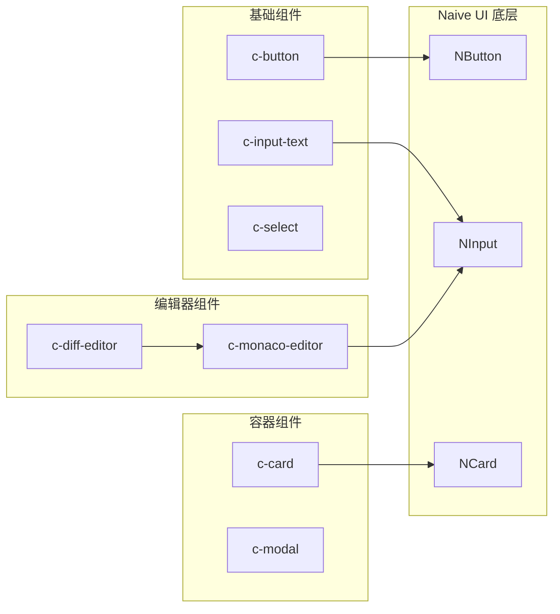

# UI 组件库

UI 组件库是 IT-Tools 的视觉层，提供统一的用户界面组件。

## 什么是 UI 组件库？

UI 组件库是一组可复用的 Vue 3 组件，为工具提供一致的界面体验。

**关键特征**:

- 基于 Naive UI 构建
- 支持明暗主题
- 支持国际化
- TypeScript 类型安全

## 代码位置

| 方面     | 位置            |
| -------- | --------------- |
| 组件目录 | `src/ui/`       |
| 主题系统 | `src/ui/theme/` |
| 颜色系统 | `src/ui/color/` |
| 示例组件 | `src/ui/demo/`  |

## 组件列表

### 基础组件

| 组件         | 路径                   | 描述         |
| ------------ | ---------------------- | ------------ |
| c-button     | `src/ui/c-button/`     | 按钮组件     |
| c-input-text | `src/ui/c-input-text/` | 文本输入组件 |
| c-select     | `src/ui/c-select/`     | 下拉选择器   |
| c-label      | `src/ui/c-label/`      | 标签组件     |

### 容器组件

| 组件       | 路径                 | 描述       |
| ---------- | -------------------- | ---------- |
| c-card     | `src/ui/c-card/`     | 卡片容器   |
| c-modal    | `src/ui/c-modal/`    | 模态对话框 |
| c-collapse | `src/ui/c-collapse/` | 折叠面板   |

### 编辑器组件

| 组件            | 路径                      | 描述              |
| --------------- | ------------------------- | ----------------- |
| c-diff-editor   | `src/ui/c-diff-editor/`   | Diff 对比编辑器   |
| c-monaco-editor | `src/ui/c-monaco-editor/` | Monaco 代码编辑器 |
| c-markdown      | `src/ui/c-markdown/`      | Markdown 渲染     |

### 交互组件

| 组件             | 路径                       | 描述         |
| ---------------- | -------------------------- | ------------ |
| c-file-upload    | `src/ui/c-file-upload/`    | 文件上传     |
| c-text-copyable  | `src/ui/c-text-copyable/`  | 可复制文本   |
| c-tooltip        | `src/ui/c-tooltip/`        | 提示信息     |
| c-buttons-select | `src/ui/c-buttons-select/` | 按钮组选择   |
| c-key-value-list | `src/ui/c-key-value-list/` | 键值对列表   |
| c-table          | `src/ui/c-table/`          | 表格组件     |
| c-alert          | `src/ui/c-alert/`          | 警告提示     |
| c-modal-value    | `src/ui/c-modal-value/`    | 模态数值显示 |

### 特殊组件

| 组件   | 路径             | 描述     |
| ------ | ---------------- | -------- |
| c-link | `src/ui/c-link/` | 链接组件 |

## 组件结构

每个组件目录包含：

```
src/ui/c-button/
├── c-button.vue       # 组件实现
└── index.ts          # 组件导出
```

## 组件使用

在工具组件中使用 UI 组件：

```vue
<script setup lang="ts">
import CButton from '@/ui/c-button/c-button.vue';
import CInputText from '@/ui/c-input-text/c-input-text.vue';
</script>

<template>
  <div>
    <c-input-text v-model:value="text" />
    <c-button @click="handleClick">点击</c-button>
  </div>
</template>
```

## 主题系统

组件支持明暗主题切换：

```typescript
// src/themes.ts
export const lightThemeOverrides = {
  // 亮色主题覆盖
};

export const darkThemeOverrides = {
  // 暗色主题覆盖
};
```

## 组件关系



## 不变量

1. **组件独立性**: 每个组件应该独立可运行
2. **类型安全**: 所有组件必须有 TypeScript 类型定义
3. **主题兼容**: 组件必须支持明暗主题
4. **国际化**: 文本内容应支持国际化
