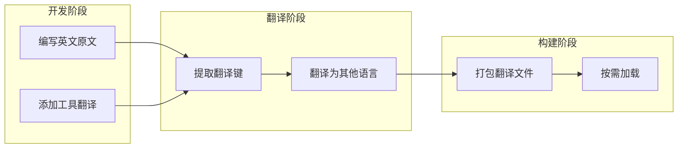

# 国际化

国际化 (i18n) 是 IT-Tools 的核心功能，支持多语言用户界面。

## 什么是国际化？

国际化使 IT-Tools 能够以多种语言显示界面，让全球开发者都能使用。

**关键特征**:

- 支持 10+ 种语言
- 基于 vue-i18n
- 支持动态语言切换
- 工具描述和界面文本全面支持

## 代码位置

| 方面      | 位置                            |
| --------- | ------------------------------- |
| i18n 插件 | `src/plugins/i18n.plugin.ts`    |
| 翻译文件  | `locales/*.yml`                 |
| 工具翻译  | `locales/en.yml` (tools.\*)     |
| 语言检测  | `src/composable/queryParams.ts` |

## 支持的语言

| 语言     | 文件             | 代码 |
| -------- | ---------------- | ---- |
| 英语     | `locales/en.yml` | en   |
| 法语     | `locales/fr.yml` | fr   |
| 中文     | `locales/zh.yml` | zh   |
| 德语     | `locales/de.yml` | de   |
| 西班牙语 | `locales/es.yml` | es   |
| 葡萄牙语 | `locales/pt.yml` | pt   |
| 俄语     | `locales/ru.yml` | ru   |
| 日语     | `locales/ja.yml` | ja   |
| 韩语     | `locales/ko.yml` | ko   |
| 阿拉伯语 | `locales/ar.yml` | ar   |

## 翻译文件结构

```yaml
# locales/en.yml 示例
app:
  title: 'IT-Tools'
  description: 'Collection of handy online tools for developers'

tools:
  base64-string-converter:
    title: 'Base64 String Converter'
    description: 'Convert strings to base64 and vice versa'

  json-viewer:
    title: 'JSON Viewer'
    description: 'Format and visualize JSON data'

common:
  copy: 'Copy'
  paste: 'Paste'
  clear: 'Clear'
```

## 使用方式

### 在 JavaScript/TypeScript 中使用

```typescript
import { translate as t } from '@/plugins/i18n.plugin';

// 在工具定义中
export const tool = defineTool({
  name: t('tools.base64-string-converter.title'),
  description: t('tools.base64-string-converter.description'),
});
```

### 在模板中使用

```vue
<script setup lang="ts">
const { t, locale } = useI18n();
</script>

<template>
  <h1>{{ t('app.title') }}</h1>
  <p>{{ t('tools.base64-string-converter.description') }}</p>
  <button @click="locale = 'zh'">中文</button>
</template>
```

## i18n 插件

```typescript
// src/plugins/i18n.plugin.ts
import { createI18n } from 'vue-i18n';

export const i18nPlugin = createI18n({
  legacy: false,
  locale: 'en',
  fallbackLocale: 'en',
  messages: {
    // 动态加载翻译文件
  },
});
```

## 语言切换

语言存储在 localStorage 中：

```typescript
import { syncRef } from '@vueuse/core';
import { useStorage } from '@vueuse/core';

syncRef(locale, useStorage('locale', locale));
```

支持通过 URL 参数指定默认语言：

```typescript
// src/composable/queryParams.ts
const getITToolsSetting = (key: string, defaultValue: any) => {
  // 从 URL 参数或 localStorage 获取设置
};
```

## 翻译键命名规范

### 工具翻译键

```
tools.<tool-name>.<property>

示例:
tools.base64-string-converter.title
tools.base64-string-converter.description
```

### 通用翻译键

```
common.<action>
common.copy
common.paste
common.clear

app.<property>
app.title
app.description
```

### 表单翻译键

```
form.<field>.<property>

示例:
form.email.label
form.email.placeholder
form.email.validation
```

## 翻译工作流



## 不变量

1. **英文为源**: 英文翻译是所有翻译的源语言
2. **键名唯一**: 翻译键在所有文件中必须唯一
3. **回退机制**: 缺失翻译回退到英文
4. **支持插值**: 翻译文本支持变量插值
