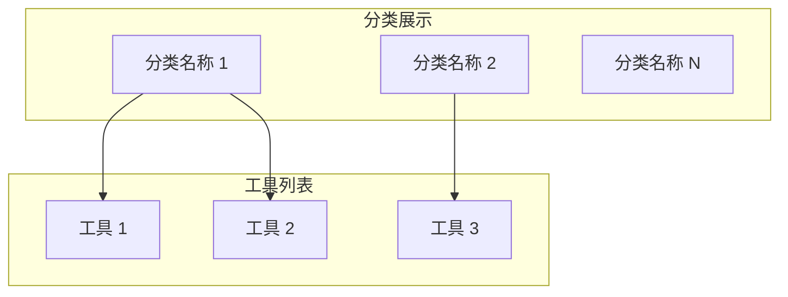

# 工具分类

工具分类是组织和管理大量工具的核心机制，帮助用户快速找到所需工具。

## 什么是工具分类？

工具分类将相关功能的工具组织在一起，提供层级结构的导航。

**关键特征**:

- 动态创建分类
- 支持嵌套分类
- 支持工具过滤
- 支持远程配置

## 代码位置

| 方面         | 位置                         |
| ------------ | ---------------------------- |
| 分类聚合逻辑 | `src/tools/index.ts`         |
| 分类类型定义 | `src/tools/tools.types.ts`   |
| 过滤配置     | `public/tools-filter.json`   |
| 外部工具配置 | `public/external-tools.json` |

## 分类结构

```typescript
interface ToolCategory {
  name: string; // 分类名称
  components: Tool[]; // 该分类下的工具列表
}
```

## 分类聚合

工具按分类聚合的逻辑：

```typescript
export const toolsByCategory = filteredModules.reduce((la, moduleDef) => {
  let found = la.find((l) => l.name === moduleDef.category);
  if (!found) {
    found = {
      name: moduleDef.category,
      components: [],
    };
    la.push(found);
  }
  found.components.push(moduleDef);
  return la;
}, [] as ToolCategory[]);
```

## 分类过滤

支持通过配置文件过滤工具分类：

```typescript
interface ToolsFilter {
  excludeCategoryFilterRegex?: string; // 排除的分类正则
  includeCategoryFilterRegex?: string; // 包含的分类正则
  excludeToolsFilterRegex?: string; // 排除的工具正则
  includeToolsFilterRegex?: string; // 包含的工具正则
}
```

### 过滤优先级

1. includeToolsFilterRegex 优先
2. includeCategoryFilterRegex 其次
3. excludeToolsFilterRegex 再次
4. excludeCategoryFilterRegex 最后

## 主要分类

项目包含以下主要分类：

| 分类       | 描述     | 示例工具           |
| ---------- | -------- | ------------------ |
| Converters | 格式转换 | Base64, JSON, YAML |
| Generators | 代码生成 | JWT, UUID, QR Code |
| Validators | 数据验证 | Email, ISBN, JSON  |
| Encoders   | 编码解码 | URL, HTML, Base64  |
| Developer  | 开发辅助 | Cron, Regex, JWT   |
| Network    | 网络工具 | IP, DNS, Port      |
| Security   | 安全工具 | Hash, Encrypt, PGP |
| Text       | 文本处理 | Diff, Sort, Lorem  |

## 分类显示

分类在前端的显示结构：



## 动态分类

分类是动态创建的，新工具可以定义新的分类名称：

```typescript
export const tool = defineTool({
  name: 'New Tool',
  path: '/new-tool',
  // ...
  category: 'New Category', // 自动创建新分类
});
```

## 不变量

1. **分类名称非空**: 每个工具必须有分类
2. **工具归属单一**: 每个工具只能属于一个分类
3. **名称字符串**: 分类名称必须是字符串
