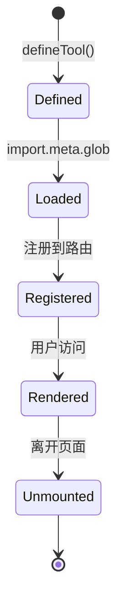

# 工具定义

工具是 IT-Tools 系统的核心概念，每个工具都是一个独立的、可复用的功能模块。

## 什么是工具？

工具代表一个具体的功能单元，它是一个可执行的计算或转换操作，帮助开发者完成特定任务。

**关键特征**:

- 独立的路由路径
- 独立的 Vue 组件
- 支持国际化
- 支持主题切换
- 按需加载

## 代码位置

| 方面         | 位置                                 |
| ------------ | ------------------------------------ |
| 工具定义函数 | `src/tools/tool.ts`                  |
| 类型定义     | `src/tools/tools.types.ts`           |
| 工具加载器   | `src/tools/index.ts`                 |
| 工具组件     | `src/tools/[tool-name]/`             |
| 示例         | `src/tools/base64-string-converter/` |

## 工具类型定义

```typescript
interface Tool {
  name: string; // 工具显示名称
  path: string; // 路由路径
  description: string; // 工具描述
  keywords: string[]; // 搜索关键词
  component: () => Promise<Component>; // 异步组件加载
  icon: Component; // 图标组件
  redirectFrom?: string[]; // 重定向路径
  isNew: boolean; // 是否为新工具
  createdAt?: Date; // 创建时间
  npmPackages?: string[]; // 依赖的 npm 包
  category: string; // 工具分类
}
```

### 必需属性

| 属性        | 类型      | 描述                           |
| ----------- | --------- | ------------------------------ |
| name        | string    | 工具显示名称，应使用国际化函数 |
| path        | string    | 路由路径，必须以 / 开头        |
| description | string    | 工具描述，应使用国际化函数     |
| keywords    | string[]  | 搜索关键词数组                 |
| component   | Function  | 返回 Promise<Component> 的函数 |
| icon        | Component | 图标组件                       |
| category    | string    | 工具分类                       |

### 可选属性

| 属性         | 类型     | 描述          |
| ------------ | -------- | ------------- |
| redirectFrom | string[] | 别名路径数组  |
| isNew        | boolean  | 是否为新工具  |
| createdAt    | Date     | 创建时间      |
| npmPackages  | string[] | 依赖的 npm 包 |

## 工具定义函数

使用 `defineTool` 函数定义工具：

```typescript
import { defineTool } from '../tool';
import { translate as t } from '@/plugins/i18n.plugin';
import { IconName } from '@vicons/tabler';

export const tool = defineTool({
  name: t('tools.tool-name.title'),
  path: '/tool-name',
  description: t('tools.tool-name.description'),
  keywords: ['keyword1', 'keyword2'],
  component: () => import('./ToolName.vue'),
  icon: IconName,
  category: 'CategoryName',
});
```

### 自动计算属性

`defineTool` 函数会自动计算以下属性：

- **isNew**: 如果 `createdAt` 在过去两周内，自动设置为 true

## 工具加载

工具通过 Vite 的 `import.meta.glob` 动态加载：

```typescript
const modules = import.meta.glob<true, string, ToolWithCategory>('./*/index.ts', {
  eager: true,
  import: 'tool',
});
```

这种方式实现：

- **按需加载**: 只有访问时才加载组件
- **Tree shaking**: 未使用的工具不会被打包
- **热更新**: 开发环境支持热更新

## 工具生命周期



## 不变量

1. **路径唯一性**: 每个工具的 path 必须唯一
2. **组件异步**: component 必须是返回 Promise 的函数
3. **图标必需**: 每个工具必须有图标组件
4. **分类必需**: 每个工具必须属于一个分类
