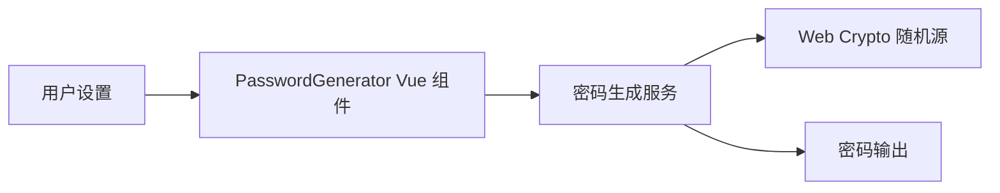

# Password Generator

Feature Name: password-generator
Updated: 2026-08-24

## Description

密码生成器作为客户端工具运行，使用 Web Crypto API 生成随机字符。工具状态通过既有查询参数与本地存储组合式函数保存。

## Architecture



## Components and Interfaces

- `password-generator.vue`：提供长度、四个字符类别、排除字符、刷新和复制交互。
- `password-generator.service.ts`：验证设置、从每个启用类别选择至少一个字符、填充剩余字符并随机打乱结果。
- `password-generator.service.test.ts`：验证长度、类别覆盖、排除字符和非法设置。
- `index.ts`：注册工具元数据与路由。

## Data Models

```ts
interface PasswordOptions {
  length: number;
  withLowercase: boolean;
  withUppercase: boolean;
  withNumbers: boolean;
  withSymbols: boolean;
  excludedChars: string;
}
```

## Correctness Properties

- 密码长度等于有效请求长度。
- 密码不包含排除字符。
- 每个启用字符类别在密码中至少出现一次。
- 随机字符通过 `crypto.getRandomValues` 选择，范围映射使用拒绝采样。

## Error Handling

- 长度小于 4 时显示长度错误。
- 未选择字符类别时显示类别错误。
- 排除字符清空启用类别时显示类别错误。
- 密码长度小于启用类别数量时显示长度错误。

## Test Strategy

- 单元测试覆盖默认类别、字符覆盖、排除字符、长度下限和无可用字符类别。
- 使用类型检查和 Lint 验证 Vue 组件与工具注册。

## References

[^1]: src/tools/token-generator/token-generator.tool.vue - 查询参数、刷新与复制交互模式。
[^2]: src/composable/queryParams.ts - 参数与本地存储状态持久化。
