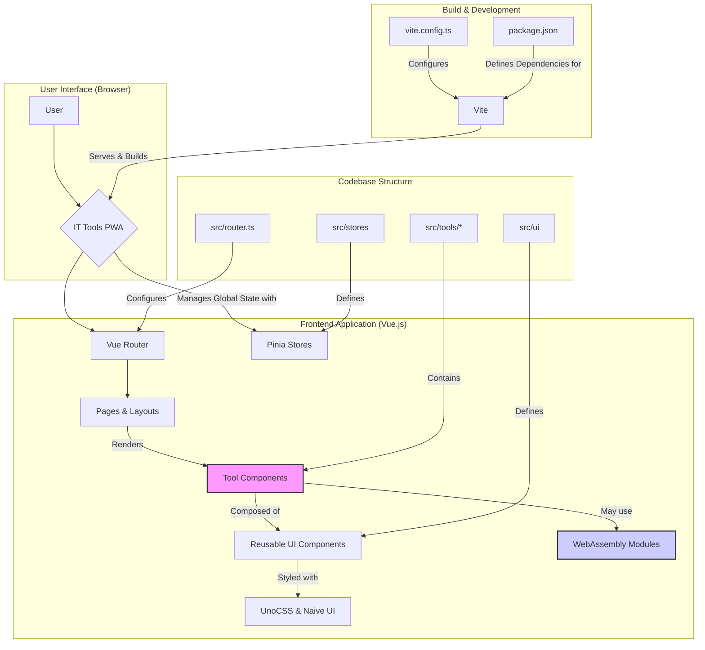

# IT Tools Project Architecture

This document outlines the architecture of the IT Tools project, a web-based collection of handy online tools for developers.

## Overview

The IT Tools project is a modern, frontend-focused application built as a **Progressive Web App (PWA)**. It leverages a modular, component-based architecture to deliver a large suite of independent tools within a single, cohesive user interface. The architecture is designed for scalability, maintainability, and performance, with a strong emphasis on developer experience.

## Core Technologies

*   **Core Framework:** [Vue.js 3](https://vuejs.org/) (Composition API)
*   **Build Tool:** [Vite](https://vitejs.dev/)
*   **Language:** [TypeScript](https://www.typescriptlang.org/)
*   **UI Framework:** [Naive UI](https://www.naiveui.com/)
*   **Styling:** [UnoCSS](https://unocss.dev/) (Utility-First CSS)
*   **State Management:** [Pinia](https://pinia.vuejs.org/)
*   **Routing:** [Vue Router](https://router.vuejs.org/)
*   **Testing:** [Vitest](https://vitest.dev/) (Unit) & [Playwright](https://playwright.dev/) (E2E)
*   **Internationalization (i18n):** [Vue I18n](https://vue-i18n.intlify.dev/)

## Architectural Diagram

## Project Structure

The codebase is organized into a clear and logical structure that promotes separation of concerns:

*   `src/tools/`: This is the core directory of the application. Each subdirectory represents a self-contained tool, encapsulating its Vue component, logic, and sometimes specific services or tests. This "micro-app" approach allows for easy addition and maintenance of tools.
*   `src/ui/` & `src/components/`: These directories contain a rich library of reusable UI components. `src/ui` appears to house a custom design system (prefixed with `c-`), ensuring a consistent look and feel across the entire application.
*   `src/composables/`: This directory holds reusable Vue Composition API functions (composables) that share stateful logic across components, such as `useCopy`, `useValidation`, etc.
*   `src/stores/`: Contains Pinia stores for managing global application state, such as the current theme or user preferences.
*   `src/router.ts`: Defines the application's routes, mapping URL paths to their corresponding pages and tool components.
*   `src/layouts/`: Defines the overall structure of the application's pages, such as the main layout with the navigation bar and content area.
*   `vite.config.ts`: The central configuration file for Vite, which orchestrates the build process, plugins, and development server.

## Key Architectural Patterns

*   **Component-Based Architecture:** The entire application is built as a tree of Vue components, promoting reusability and modularity.
*   **Tool-Centric Modularity:** The project is not a single monolithic application but a collection of independent tools. This makes it easy to develop, test, and deploy new tools without impacting others.
*   **Progressive Web App (PWA):** The application is designed to be a PWA, enabling offline access, installability on user devices, and a native-app-like experience.
*   **Automatic Imports:** The project uses `unplugin-auto-import` and `unplugin-vue-components` to automatically import components and APIs, which simplifies development and reduces boilerplate code.
*   **WebAssembly for Performance:** The use of WebAssembly (`.wasm`) modules for computationally intensive tasks is a key architectural decision to ensure high performance in the browser.

## Build Process

The build process is managed by Vite and is highly optimized:

*   **Fast Development:** Vite's native ESM-based dev server provides extremely fast hot module replacement (HMR) for a smooth development experience.
*   **Optimized Production Build:** For production, Vite bundles the code with Rollup, performs tree-shaking to eliminate unused code, and is configured to handle code splitting and PWA generation.
*   **Environment-Specific Builds:** The configuration is set up to create different builds for different environments (e.g., local development vs. Vercel deployment), optimizing for performance and caching.

This architecture results in a highly scalable and maintainable application that can support a large and growing collection of developer tools while providing a fast and responsive user experience.